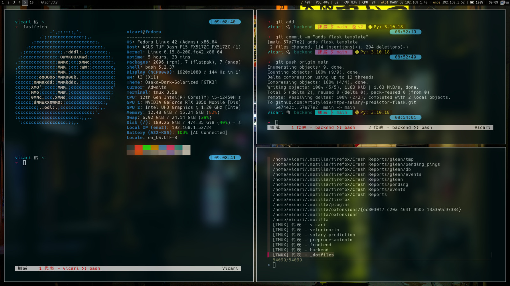
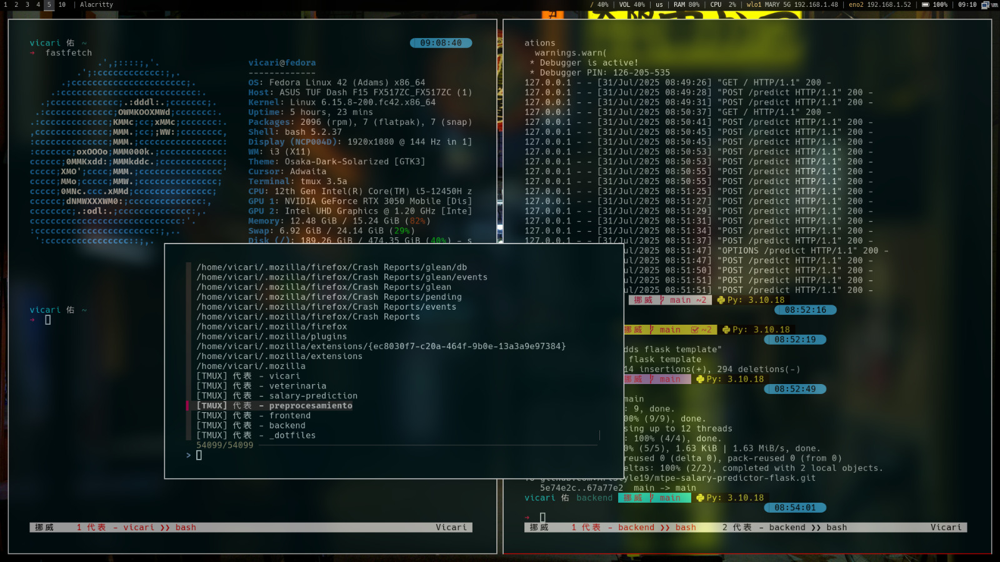
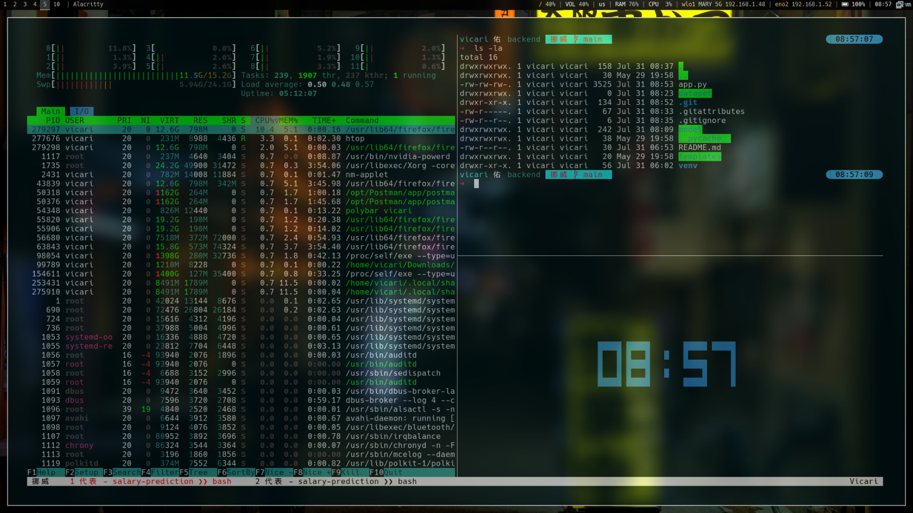
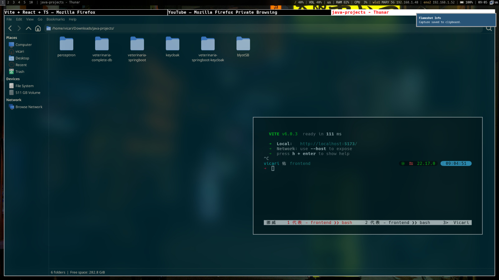
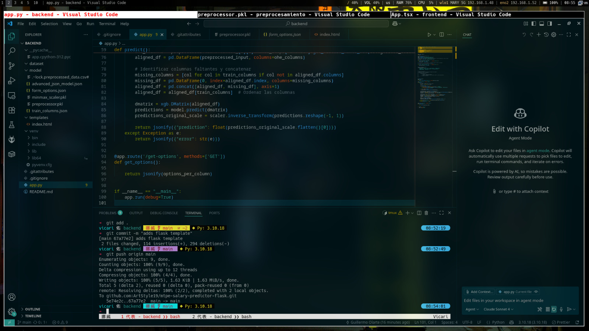
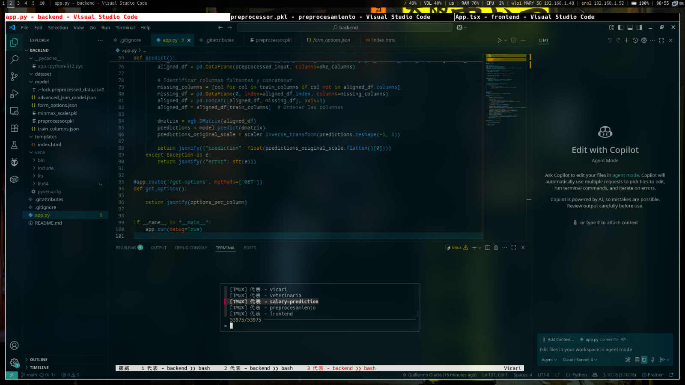
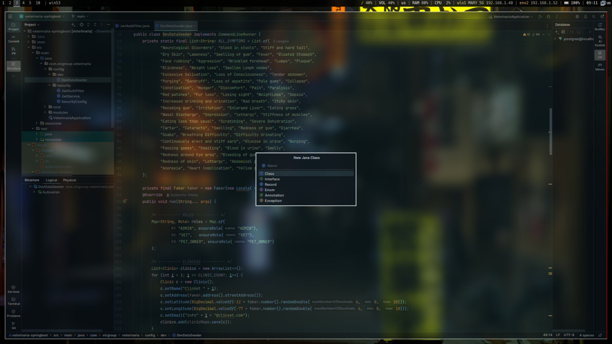

# 🛠️ .dotfiles — Personalized GNU/Linux Setup

## Jorge Guillermo Olarte Quispe

## Distro: Fedora Linux

## Window Manager: i3-spin + Polybar + Picom

## Style: Solarized Osaka

Minimal and highly customizable development environment for GNU/Linux.  
Includes configuration files for terminal tools, a tiling window manager, aesthetic theming, and scripting to boost productivity and workflow.

---

## Repository Structure

| Folder              | Description                                                 |
| ------------------- | ----------------------------------------------------------- |
| `alacritty/`        | Alacritty terminal configuration (GPU-accelerated)          |
| `bash/`             | Aliases, prompt, and shell settings for Bash                |
| `git/`              | Custom global Git configuration                             |
| `gtk-3.0/`          | GTK theming for graphical applications                      |
| `i3/`               | i3-spin WM settings, keybindings, and autostart scripts     |
| `libinput/`         | Touchpad and trackpad sensitivity/tuning                    |
| `lvim/`             | LunarVim + extended Neovim configuration                    |
| `omp/`              | Oh My Posh prompt customization                             |
| `picom/`            | Window compositor (transparency, blur, shadows)             |
| `polybar/`          | Top bar with custom modules and styles                      |
| `scripts/`          | Utility scripts                                             |
| `tmux/`             | Terminal multiplexer (persistent sessions, custom bindings) |
| `vim/`              | Classic Vim setup (fallback or minimalist use)              |
| `wallpapers/`       | Curated collection of wallpapers for desktop theming        |
| `bash_installer.sh` | Bash script for automatic config deployment                 |
| `readme-images/`    | Screenshots used in this README file                        |

---

## Desktop Preview

| Title   | Image                        |
| ------- | ---------------------------- |
| Image 1 |  |
| Image 2 |  |
| Image 3 |  |
| Image 4 |  |
| Image 5 |  |
| Image 6 |  |
| Image 7 |  |

---

`

## Summary

From a fast terminal setup to a tiled WM with blur and transparency, every dotfile is built with **efficiency and aesthetics in mind**.

Feel free to fork or adapt any part of this setup for your own use
